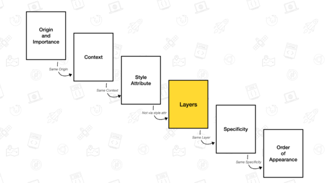
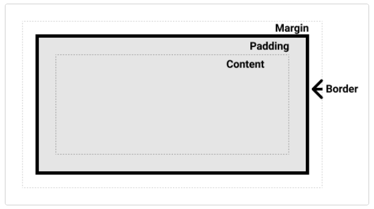

## CSS를 HTML에 적용하는 세 가지 방법은 무엇일까요?
1. 외부 스타일시트 
    * .css확장자로 된 별도의 CSS파일을 연결시키는 것. 가장 일반적이고 유용한 방법이다.
    * `<link rel="stylesheet" href="파일명.css">`
2. 내부 스타일시트
    * HTML문서 내에 ``   
      `</head>`  

3. 인라인 스타일
    * 단일 HTML요소의 style속성에 CSS 코드를 적는 것. 가장 추천되지 않는 방법이다.
    * `<h1 style="css적기!!"></h1>`

### 세 가지 방법 각각의 장단점은 무엇일까요?
| |장점|단점|
|---|---|---|
|`외부 스타일시트`|* 단일 CSS파일을 여러 웹 페이지에 링크하여 동일한 CSS스타일시트로 모든 페이지의 스타일을 지정할 수 있어 효율적인 방법이다.   * 별도의 파일로 분리되어 있어 가독성이 좋다.   * 한 번의 수정으로 여러페이지의 동일 스타일을 변경할 수 있어 유지보수에 효율적이다.|* 파일이 분리되면서 파일 갯수가 많아서 단순한 문서에는 오히려 좋지 않을 수 있다.|
|`내부 스타일시트`|* 외부 CSS파일을 수정할 수 없는 환경에서 활용될 수 있다.   * 인라인 스타일에 비해 비교적 깔끔하고 수정이 쉽다.|* 페이지가 두 개 이상일 경우, 여러 페이지에 균일한 CSS스타일을 적용하기 위해선 모든 페이지에 내부 스타일 시트를 넣어야하기 때문에 비효율적이다. 또한 동일한 스타일 변경을 위해 각 페이지마다 수정을 해야하므로 유지보수를 어렵게 한다.|
|`인라인 스타일`|* HTML태그에 직접 작성하기 때문에 특정 태그에 스타일을 적용하고 싶을 때 가장 빠른 방법이다.   * 가장 높은 우선 순위를 가지고 있어 외부 스타일시트에 어떤 것이 쓰여 있어도 우선 적용된다. |* 동일한 스타일을 적용하고 싶을 때 각 요소에 일일이 추가해야한다.   * HTML과 CSS 코드가 뒤섞여 복잡해지고, 한 번의 간단한 동일한 스타일 변경을 위해 여러번 수정을 해야하기 때문에 유지보수에 가장 비효율적인 방법니다.   * HTML 파일이 사이즈를 너무 크게 만들어, 웹페이지가 로딩되는 시간을 오래 걸리게 한다.|

***

## CSS 규칙의 우선순위는 어떻게 결정될까요?
* 동일한 속성의 다른 값을 동일한 요소에 적용하는 다수의 규칙을 만들어 냈을 때 충돌이 일어나는데, Cascade와 Specificity, 상속 매커니즘이 함께 작동하여 규칙이 제어된다.
* `Cascade`는 한 요소에 CSS 스타일이 여러개 적용되어 있을 때, 여러 스타일 중 위에서부터 아래로 우선 순위가 정해진다는 것. 가장 아래에 있는 스타일이 가장 우선순위가 높음.
* `Specificity`은 CSS선언을 결정하는데 사용하는 알고리즘으로 CSS선택자의 가중치를 계산하여 요소에 적용할 속성 값을 결정한다. 선택자의 선택이 얼마나 구체적인지를 측정하는 것.
* `상속`은 부모요소에 설정된 일부 CSS 속성 값이 자식 요소에도 상속이 되는 것이다.
* CSS의 우선순위를 결정하는 세가지 요소

    |중요도|명시도|코드 순서|
    |-----|-----|---|
    |- 사용자 > 제작자 > 브라우저   - 중요스타일 > 일반 스타일|- 인라인 스타일 > id 선택자 지정 > 클래스 선택자 지정 > 태그 지정| - 중요도와 명시도가 같다면 코드의 순서를 고려하는데, 나중에 적용된 스타일이 우선순위가 된다.|

    >* 사용자 스타일 : 색약자, 저시력자 등을 위해서 특별히 설정된 스타일. 시스템에서 설정한 것이기 때문에 개발자가 변경이 불가능하다. 가장 우선시된다.
    >* 제작자 스타일 : 개발자가 적용한 스타일
    >* 브라우저 스타일 : 브라우저에 기본으로 설정된 스타일
    >* 중요 스타일 : 어떤 스타일보다 최우선으로 적용하고 싶을 때 !important를 붙여 사용한다. (ex. color:red !important;) 
    >* 일반 스타일 : 일반적으로 개발자가 작성한 스타일

* 적용 예시 :    
    1. h1 {color: red;}  
     h1 { color: blue;}  
     의 경우 blue색이 적용 
    2. .className {color: red;}  
      h1 {color: blue;}  
      의 경우 빨간색이 적용
    3. #winning {background-color: red;border: 1px solid black;}  
       .better {background-color: gray;border: none !important;}   
        의 경우 배경색은 빨간색이 적용되고, 가장자리 선은 없다.

* 개발자는 CSS를 작성할 때 위와 같은 것들을 신중하게 고려하여야 하는데, 적절한 코드 구성 계획이 없으면 나중엔 과한 !important를 필요하게 하거나 하는 등 Cascade가 불리하게 작용할 수 있다.
이러한 문제를 쉽게 제어할 수 있도록 Cascade 알고리즘에 Layers라는 개념이 도입되었는데, 명시도와 작성순서보다 더 우위의 기준이다. 레이어에도 순서가 적용되며, 늦게 생성될수록 우선순위에 있고, 레이어를 사용하지 않은 스타일이 레이어가 있는 스타일보다 우선순위에 있다.
    
    * @layer 레이어이름{
        css적기~!!
    }

***

## CSS의 박스모델은 무엇일까요? 박스가 화면에서 차지하는 크기는 어떻게 결정될까요?
* CSS에는 `블록 박스`와 `인라인 박스` 두 가지 유형이 있다.
* CSS박스 모델은 전체적으로 블록 상자에 적용되며, 박스의 다른 부분(여백, 테두리, 패딩 및 콘텐츠)이 함께 작동하여 페이지에서 볼 수 있는 박스를 만드는 방법이다. 인라인 박스는 박스 모델에 정의된 일부 동작만 적용된다.

> * 콘텐츠 박스 : 콘텐츠가 표시되는 영역. width와 height와 같은 속성을 사용하여 크기를 조정
> * 패딩 박스 : 콘텐츠 주위의 공백 영역. padding 속성을 사용하여 크기를 조정. padding은 콘텐츠를 테두리에서 밀어내는데 사용된다.
> * 테두리 박스 : 콘텐츠와 패딩을 감싼다. border 속성을 사용하여 크기를 조정
> * 여백 박스 : 이 상자와 다른 요소 사이의 공백. 가장 바깥의 영역. margin 속성을 사용하여 크기를 조정. 요소와 요소사이의 여백을 지정하는데 사용된다.

* 표준 CSS 박스 모델에서 박스의 크기는  
    너비 = width값 + 좌우 padding값 + 좌우 margin값 + 좌우 border두께    
    상하 = width값 + 상하 padding값 + 상하 margin값 + 상하 border두께  
이다.
* 대체 CSS 박스 모델에서 박스의 크기는 해당 박스에 box-sizing:border-box;를 지정해줌으로써 설정되며, 이때의 너비값은 width값이고 상하값은 height값이다.

***

## `float` 속성은 왜 좋지 않을까요?
* `float`는 요소를 띄워서 정렬을 하는 속성이다. 속성값으로 left 혹은 right를 주어 요소를 좌/우 배치를 할 수 있다. 블록요소에게 `float`속성을 주게 되면 마치 인라인 블록처럼 컨텐츠 크기만큼 영역이 잡히게 된다. 
* `float`를 이용하면 `float`를 적용한 자식을 가진 부모요소가 자식요소의 높이를 반영하지 못해 영역을 제대로 잡지 못하는 문제가 발생한다. 이는 다음 요소의 레이아웃 배치에 영향을 끼치게 된다.
* `float` 이를 해결하기 위해 `부모요소에 overflow:hidden`을 적용하거나 다음 요소에 `clear`를 적용하는 등의 방법이 있지만,  
    1. `부모요소에 overflow:hidden`을 적용 : 부모 요소 안에 그 영역을 벗어나는 콘텐츠가 있다면 해당 콘텐츠가 보이지 않게 됨.
    2. 다음 요소에 `clear`를 적용 : 다음 요소가 다른 요소로 변경되면 `clear`속성도 제거, 추가해줘야여 번거로움.  
과 같은 단점들이 존재하여 사용하기 좋지 않다고 생각된다. 

***

## Flexbox(Flexible box)와 CSS Grid의 차이와 장단점은 무엇일까요?
* `flexbox`는 단반향(한 줄의 행 혹은 열) 1차원적 레이아웃에 최적화된 CSS속성이다. 콘텐츠 위주의 정렬을 할 때 사용
* 장점
    > * 플렉스 아이템은 플렉스 컨테이너의 높이만큼 늘어날 수 있어서 같은 높이의 칼럼 레이아웃을 구현할 수 있다.
    > * 중앙에 손쉽게 배치가 가능하다.
    > * 방향에 구애를 받지 않는다.
    > * 브라우저 창의 크기가 변경됐을 때 그 공간에 따라 각 행에 나열되는 아이템의 수가 적절하게 조정된다.
* 단점
    > * 행이 바꼈을 때, 각 행이 자체 플렉스 컨테이너가 되어 다른 행의 항목 배치를 확인하지 않고 서로 정렬  
      
* `grid`는 행과 열 모두를 염두에 둔 2차원적 레이아웃을 고려하여 설계된 CSS속성이다. 레이아웃 위주의 정렬을 할 때 사용
* 장점
    > * 행과 열 모두에서 레이아웃 제어를 할 수 있다. ==> 복잡한 레이아웃 설계 가능
    > * 행이 바꼈을 경우에도 행과 열이 맞추어짐
    > * 쉽게 여백 크기를 맞출 수 있다.
    > * 반응형 디자인을 쉽게 구현할 수 있다.
* 단점
    > * 경직된 구조를 만들수도 있다.  

* flex와 grid의 두드러진 차이점은 flex는 1차원적 레이아웃, grid는 2차원적 레이아웃의 표현에 최적화된 속성이라는 것인데, 두 속성들은 작은 구성 요소가 2차원이 될 수 있고, 큰 레이아웃이 1차원의 레이아웃으로 더 잘 표현될 수 있기 때문에 각각의 이점을 활용하여 구성하기!   

***

## CSS의 비슷한 요소들을 어떤 식으로 정리할 수 있을까요?

#### 같은 css를 여러 요소에 주고 싶을 때
1. 동일한 클래스명을 요소에 부여해서 클래스명에 CSS 부여하기
2. CSS에서 ','로 구분하여 요소를 나열한 후 CSS 부여하기  
    ex) li, div, p{color: #222;}

#### 유사요소 및 유사클래스

* `유사요소`는 선택자에 추가하는 것으로, 선택한 요소의 일부분에만 스타일을 입힐 수 있다.  
    클래스명::유사요소
* `유사클래스`는 선택한 요소가 특정 상태일때 사용한다. 가리키거나 클릭하는 등의 사용자의 행동에 반응해서 적용된다.  
    클래스명::유사클래스
* 유사클래스 정리

|유사클래스|방식|
|---|---|
|:first-child|형제 요소 중 제일 첫번째 요소를 선택한다.|
|:first-of-type|형제 요소 중 자신의 유형과 일치하는 제일 첫번째 요소를 선택한다.|
|:last-child|형제 요소 중 제일 마지막 요소를 선택한다.|
|:last-of-type|형제 요소 중 자신의 유형과 일치하는 제일 마지막 요소를 선택한다.|
|:only-child|형제가 없는 유일한 요소를 선택한다.|
|:focus|양식의 입력 칸등에 포커스를 받은 요소를 선택한다. 보통 사용자가 요소를 클릭 또는 탭했을 때를 의미한다.|
|:active|활성화한 요소를 선택한다. 마우스를 사용하는 경우, 보통 마우스 버튼을 누르는 순간부터 떼는 순간까지를 의미한다.|
|:link|href속성을 가진 요소 중 방문하지 않은 모든 요소를 선택하며, 기본적으로 파란색글자와 밑줄로 나타내진다.|
|:visited|사용자가 방문한 적이 있는 링크를 가진 요소를 선택한다.|
|:hover|요소와 포인팅 장치가 상호작용 중인 요소를 선택하는 것으로, 보통 마우스 포인터가 요소 위에 올라가 있을 때를 의미한다.|
> * :link -> :visited -> :hover / :active 순으로 배치해야한다. 
* 유사요소 정리

|유사요소|방식|
|---|---|
|:before|요소의 내용 앞에 일부 내용을 삽입하는데 사용할 수 있다.보통 요소에 장식용 콘텐츠를 추가할 때 사용한다.|
|:after|요소의 내용 뒤에 일부 내용을 삽입하는데 사용할 수 있다. 보통 요소에 장식용 콘텐츠를 추가할 때 사용한다.|
|:first-line|텍스트의 첫 번째줄을 선택한다.|
|:marker|일반적으로 글머리 기호 또는 숫자가 포함된 목록에 글머리 기호나 숫자등을 지정해 줄 때 선택하여 사용한다.|
|:placeholder|`input`이나 `textarea`의 placeholder를 선택할 때 사용한다.|

