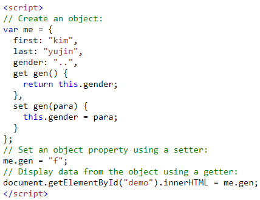
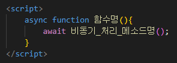
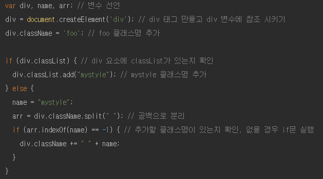
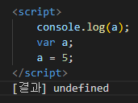
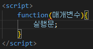
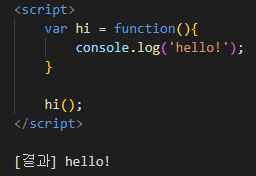
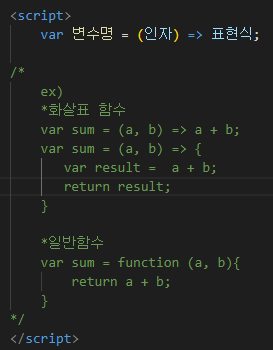
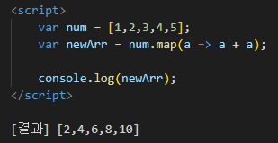

## 자바스크립트는 버전별로 어떻게 변화하고 발전해 왔을까요?
* 자바스크립트는 1990년대 Netscape회사에 의해 최초로 개발되었다. MS사에서 JScript를 사용하면서 크로스브라우징 이슈가 붉어졌고 자바스크립트의 표준화의 필요성이 대두되었다. 그렇게 1997년 ECMA-262란 이름으로 자바스크립트 기술 규격이 채택되었다.

### 자바스크립트의 버전들을 가리키는 ES5, ES6, ES2016, ES2017 등은 무엇을 이야기할까요?
* ES(ECMAScript)는 자바스크립트를 표준화하기 위해 만들어진 ECMA-262기술 규격에 따라 정의하고 있는 자바스크립트 표준 사양이다.
<table>
    <tr><th>버전</th><th>특징</th></tr>
    <tr><td>ES1(1997)</td><td>-</td></tr>
    <tr><td>ES2(1998)</td><td>-</td></tr>
    <tr><td>ES3(1999)</td><td>-</td></tr>
    <tr><td>ES4</td><td>언어에 얽힌 정치적, 견해의 차이로 버려졌다.</td></tr>
    <tr>
        <td><b>ES3(1999)<b></td>
        <td>- 우리가 흔히 말하는 자바스크립트 
            - 함수 단위의 스코프, 호이스팅, 프로토타입, 모듈화 미지원, 클로저 등등 자바스크립트의 기본적인 특징들이 정의되었다. 
            - 대부분의 브라우저에서 지원하고, IE8까지 지원된다. 
            - add <b>try/catch, switch, do-while</b>
        </td>
    </tr>
    <tr>
        <td><b>ES5(2009)</b></td>
        <td>- IE9부터 본격적으로 지원하지만 es5-shim을 사용하면 하위 버전에서도 특정 기능들을 지원해준다. 
            - strict 모드 지원 : ex)선언되지 않은 변수를 사용할 수 없음 
            - object 대한 속성 <b>getters and setters</b> 
              
             
              
            - JSON 지원  
            &nbsp;&nbsp;<b>JSON.parse() : 텍스트를 javascript객체로 변환하는 데 사용</b> 
            &nbsp;&nbsp;<b>JSON.stringify() : 문자열로 변환하는데 사용</b> 
            - add <b>Function bind()</b> : bind()메소드를 사용하면 다를 객체의 메소드를 빌릴 수 있다. 
            - add <b>String.trim(), Array.isArray(), Array forEach(), Array map(), Array filter(), Array reduce(), Array reduceRight(),</b>  
            &nbsp;&nbsp;<b>Array every(), Array some(), Array indexOf(), Array lastIndexOf(), Date.now(), Date toISOString(), Date toJSON()</b> 
            - Reserved words as property names : 예약어를 속성 이름으로 허용 
            - Trailing commas : 객체 및 배열 정의에서 마지막 쉼표를 허용
        </td>
    </tr>
    <tr>
        <td><b>ES6(2015)</b></td>
        <td>- <b>let, const</b> 키워드</b> 추가 : block scope를 가짐 
        - <b>arrow 문법</b> 추가 : 간결해진 함수 작정 가능 
        - add iterator, generator : .values() 메소드를 사용하여 이터레이터를 생성하고 이터레이터가 가지고 있는 next() 메소드를 이용하여 다음 값으로 넘어갈 수 있다. 
         제너레이터는 이터레이터를 사용해 실행을 제어하는 함수이다. 제너레이터 함수를 이용하면 함수를 일시정지하거나 다시 시작하거나 하는 등 실행을 제어할 수 있다. function* 함수명(){}) 
        - module import, export 
        - add <b>for..of</b> : 반복 가능한 데이터 구조를 반복할 수 있음 
        - promise 도입 : 비동기함수를 실행하고 성공했을때는 resolve(), 실패했을 때는 reject()를 실행 
        - spread 연산자 : '...'를 이용해 기존의 배열의 전체 또는 일부를 빠르게 복사할 수 있음 
        - Default Parameters : 함수의 매개변수가 기본값을 가질 수 있음 
        - Classes : class 키워드를 사용하여 클래스 생성, constructor()를 사용하여 메소드 추가 
        - add <b>String.includes() : 문자열에 지정된 값이 포함되어 있으면 true를 반환 
         &nbsp;&nbsp;String.startsWith() : 문자열이 지정된 값으로 시작하면 true 반환 
         &nbsp;&nbsp;String.endsWith() : 문자열이 지정된 값으로 끝나면 true를 반환</b> 
        - add <b>Array.from() : 배열로 만들어줌 
         &nbsp;&nbsp;Array find() : 테스트 함수를 통과하는 첫 번째 배열 요소의 값을 반환  
         &nbsp;&nbsp;Array findIndex() : 테스트 함수를 통과하는 첫 번째 배열 요소의 인덱스를 반환</b>
        </td>
    </tr>
    <tr>
        <td><b>ES7(=ES2016)</b></td>
        <td>- 많은 변화가 있지 않고 두가지 특징만 소개되었다. 
        - <b>Array.includes()</b> : 배열의 포함 여부를 알 수 있음. NaN의 포함 여부도 알 수 있음 
        - Exponentiation oprator : **연산자 추가, Math.pow()함수와 동일한 기능으로 거듭제곱 기능을 함 
        </td>
    </tr>
    <tr>
        <td><b>ES8(=ES2017)</b></td>
        <td>- padStart(), padEnd() : 문자열의 패딩 메소드, 패딩을 채울 문자를 지정해 줌 
        - Object.values() : 객체의 value를 순회 
         &nbsp;&nbsp;Object.entries() : key와 value(튜플로)를 순회 
        - Object.getOwnPropertyDescriptors() : 객체를 인자로 넘겨, 해당 프로퍼티의 설명자들을 반환 
        - Trailing commas : 객체뿐 아니라 함수에서도 인자의 마지막에 콤마를 붙일 수 있음 
        - Async & await : 비동기처리시 특정 코드의 연산이 끝날 때까지 기다리게 해줌 
         
         
         
        이 때, 비동기 처리 메소드가 반드시 프로미스 객체를 반환해야 await가 의도한 대로 동작한다.
        </td>
    </tr>
    <tr>
        <td><b>ES9(=ES2018)</b></td>
        <td>- Object Rest : 객체를 해체하고 선택되지 않은 나머지 속성들을 모아줌 
        &nbsp;&nbsp;Object Spread : 기존에 배열에서만 사용되었던 스프레드 연산자를 객체에서도 사용 가능하게 됨 
        - Promise finally : promise에 finally가 추가. 성공, 실패의 여부와 상관없이 무조건 실행되는 메소드 
        - Async iteration : async문법을 for...of문에서 사용이 가능하게 되어 반복적인 비동기 작업을 쉽게 처리할 수 있게 됨 
        - 정규표현식의 강화 
        &nbsp;&nbsp;&nbsp;&nbsp;lookbehind가 생김 : 특정 문자열 뒤의 문자열을 찾는 기능 
        &nbsp;&nbsp;&nbsp;&nbsp;유니코드를 위한 u 플래그가 추가되어 특정 유니코드를 정규표현식으로 표현 가능 
        &nbsp;&nbsp;&nbsp;&nbsp;캡쳐링 그룹에 이름을 붙일 수 있음 : 캡쳐링 그룹이란 정규표현식에서 괄호로 묶어준 것들로 groups속성으로 접근할 수 있음 
        &nbsp;&nbsp;&nbsp;&nbsp;s(dotAll) 플래그 : .표현식은 개행문자를 제외했으나, s 플래그를 달면 개행식도 포함됨
        </td>
    </tr>
</table>

### 자바스크립트의 표준은 어떻게 제정될까요?
* `TC39`는 **자바스크립트의 표준 명세인 ECMAScript의 명세**들을 논의하고 표준을 제정하는 실질적인 기구이다.  
표준 명세는 단순히 TC39 내의 결정을 통해서만 이루어지진 않는다.

>**0단계** - (TC39의 위원이 아니라도)누구라도 고려한 가치가 있다고 생각하는 아이디어를 제출할 수 있다.  
>↓  
>**1단계(제안)** -  제안이 더 연구되기로 합의가 이루어지면 커뮤니티 구성원들이 토론하고 개발하여 기술을 연구하고 아이디어를 구체화한다.  
>↓  
>**2단계(초안)** - 1단계가 준비가 되면 TC39 회의에 1단계 제안을 제출한다. 커뮤니티가 정확한 구문, 의미 체계, API등을 구체화하고 공식 사양 언어를 사용하여 해결 방법을 자세히 설명한다. 실제로 사용하면서 테스트 할 수 
있도록 폴리필(변경된 표준을 준수할 수 있게 기존 함수의 동작 방식을 수정하거나, 새롭게 구현한 함수의 스크립트)이 생성되기도 한다.      
>↓  
>**3단계(후보)** - 최종 초안이 제출된다. 이는 제안이 자바스크립트 엔진에서 구현될 준비가 되어 있다는 합의가 이루어졌다는 의미이다. 이 단계에서 제안 자체는 거의 변경되지 않고, 구현 중 나온 피드백이 반영되기도 한다.  
>↓  
>**4단계(완료)** - 기능이 완료된 상태이며, 두개 이상의 별개의 호환 구현에서 TC39의 인수 테스트를 통과해야한다. 이 기준을 충족하고 ECMAScript 편집자 그룹이 이를 수락하면 완료된다.  
 
이런 과정을 통해 제안이 자바스크립트 표준에 들어가는데, 모든 변경이 이런 과정을 거치는 것은 아니고 작은
변경사항 정도는 TC39에서 합의하여 변경할 수 있다. 

***

## 자바스크립트의 문법은 다른 언어들과 비교해 어떤 특징이 있을까요?
1. 이벤트 중심의 프로그래밍 언어이다.
2. 인터프리터 언어이다. 컴파일 과정을 거치지 않는다.
3. HTML 문서 내에 기술되어지고 HTML 문서와 함께 수행되어진다.
4. 객체 지향적 특성을 모두 가지고 있는 것은 아니지만 객체를 정의하여 사용할 수 있는 객체 기반의 언어이다.
5. 함수형 프로그래밍 언어이다. 함수를 객체처럼 다루고, 함수에 함수를 인수로 넘길 수 있다.(=함수가 값이 될 수 있다.)
6. **C, Java 언어와는 다르게 변수를 선언할 때 데이터 타입을 미리 정하지 않는다.**
7. 피연산자의 타입이 반드시 일치할 필요가 없다. **암묵적 타입 강제 변환**을 통해 연산을 수행한다.
8. 블록 유효범위를 생성하지 않고, **함수 단위의 유효범위**가 생성된다.
9. 자바스크립트의 객체는 객체지향의 상속을 구현하기 위해 `프로토타입`이라고 불리는 객체의 프로퍼티와 메소드를 상속받을 수 있다.

### 자바스크립트에서 반복문을 돌리는 방법은 어떤 것들이 있을까요?
1. for문
    * 반복 횟수가 정해져 있을 때 유리하다.
    * for(var i = 0; i < num ; i++){  
        // 실행할 코드  
     }
2. while문
    *     
    * while(i < num){  
        // 실행할 코드  
        증감식  
    }  
3. do...while문
    * 
    * do{
        // 실행할 코드
        증감식
    } while(i < num)

    
* 반복문들은 대체로 서로 교체할 수 있는데, 각각의 문제와 선호에 맞게 사용하면 될 듯하다.
* 반복문을 종료하고 싶을 때 `break`
    * `break`문은 즉시 반복문을 종료하고 브라우저가 반복문 뒤에 있는 코드로 이동하게 한다.
* 반복문 건너뛰기
    * `continue`문은 `break`와 유사하지만 반복문을 완전히 탈출하는 것이 아니라 반복문의 다음 반복으로 건너띈다.

 

☆ 추가

4. for in문
    * 해당 객체가 상속받는 프로토타입의 모든 프로퍼티의 키를 반복한다.
    * for(var key in 객체){  
        // 실행할 코드  
     }
5. for of문
    * 이터러블을 반복할 때 유리하다.
    * for(var item of 이터러블){  
        // 실행할 코드  
        }
6. forEach문
    * 배열을 반복할 때 유리하다.
    * 배열.forEach(function(value, index)){  
        // 실행할 코드  
        }  
7. Object.keys(객체), Object.values(객체), Object.entries(객체) 
    * 객체를 순회할 때 사용한다.
    * 객체 프로퍼티의 '키'/ '값' / '[키, 값]'을 배열로 반환한다.
8. 배열.map(){}, 배열.filter(){}문
    * 배열을 순회할 때 사용한다.
    * 배열.map(){} -> forEach문과 동일하고, 각 콜백함수에서 return하는 값들로 새로운 배열을 만들어 반환한다는 차이점이 있다.
    * 배열.filter(){} -> forEach문과 동일하고, 각 콜백함수에서 return하는 값이 true일 때만, value 값들로 새로운 배열을 만들어 반환한다는 차이점이 있다.

***

## 자바스크립트를 통해 DOM 객체에 CSS Class를 주거나 없애려면 어떻게 해야 하나요?
1. getElementById(), getElementsByClassName() 등과 같은 메소드를 이용하여 요소를 특정하고 아래와 같은 메소드들을 이용하여 추가, 삭제한다.
<table>
    <tr><td><b>.classList.add('클래스명')</b></td><td>새로운 클래스 값을 추가한다.</td></tr>
    <tr><td><b>.classList.remove('클래스명')</b></td><td>기존의 클래스 값을 삭제한다.</td></tr>
    <tr><td><b>.classList.toggle('클래스명)</b></td><td>클래스 값이 추가되었다 삭제되도록 한다.</td></tr>
    <tr><td><b>.classList.replace('기존 클래스명', '새 클래스명')</b></td><td>특정 클래스 값을 다른 클래스 값으로 교체한다.</td></tr>
</table>

&nbsp;&nbsp; `ex) document.getElementById('a').classList.add('클래스명');`  
&nbsp;&nbsp; `ex) document.getElementById('a').classList.remove('클래스명');`

2. DOM 객체를 특정하고 setAttribute() 메소드를 이용하여 class 속성을 생성해준 후 클래스명을 추가, 삭제한다.    
`ex) document.getElementById('a').setAttribute('class', '클래스명');`  
`ex) document.getElementById('a').setAttribute('class', '');`

3. DOM 객체를 특정하고 className을 이용하여 클래스명 추가, 삭제한다.  
`ex) document.getElementById('a').className = '클래스명, 클래스명, 클래스명'`  
3-1. += 연산자를 사용하여 추가하기    
`ex) document.getElementById('a').className += ' 클래스명'`

☆ 추가 [DOM 객체를 이용한 CSS스타일 변경]
1. DOM 객체를 특정하고 style.property를 이용하여 CSS를 변경한다. 
`ex) document.getElementById('a').style.속성 = '새 스타일'` 
    * property에는 backgroundColor, color, position, width 값 등이 있다.  
2. 스타일시트 활성화와 비활성화  
`ex) document.getElementById('b').disabled = true` ==> `b`라는 id명을 가진 스타일시트가 비활성화된다.    
`ex) document.getElementById('b').disabled = false` ==> `b`라는 id명을 가진 스타일시트가 활성화된다.

### IE9나 그 이전의 옛날 브라우저들에서는 어떻게 해야 하나요?
* IE9 이하에서는 classList 속성을 지원하고 있지 않기 때문에, 
    1. IE9 이하 버전용 크로스브라우징 소스를 추가하거나,   
     
    ex)
    
    
     
    2. DOM 객체를 특정하고 setAttribute() 메소드를 이용하여 class 속성을 생성해준 후 클래스명을 추가, 삭제한다.   
    3. DOM 객체를 특정하고 className을 이용하여 클래스명 추가, 삭제한다. 
의 방법으로 해결하면 될 듯하다.

***

## 자바스크립트의 변수가 유효한 범위는 어떻게 결정되나요?
* 자바스크립트에서 변수는 유효 범위에 따라 **지역 변수**와 **전역 변수**로 구분된다.
* 보통 `{}중괄호`가 기준이 되어 구불할 수 있다.
* 지역 변수와 전역 변수를 구분하면 변수 이름이 중복됐을 때, 같은 이름을 가진 변수라도 상황에 따라 각각 다르게 사용될 수 있다는 장점이 있다.
 

1. **지역 변수** 
    * 지역 변수란 함수 내에서 선언된 변수를 가리킨다.
    * 변수가 선언된 함수 내에서만 유효하며, 함수가 종료되면 메모리에서 사라진다.
    * 함수의 매개변수도 함수 내에서 정의되는 지역 변수처럼 동작한다.
2. **전역 변수**
    * 전역 변수란 함수의 외부에서 선언된 변수를 가리킨다.
    * 프로그램의 어느 영역에서나 접근할 수 있으며, 웹페이지가 닫혀야만 메모리에서 사라진다.
 

* 지역 변수를 선언할 때에는 반드시 var, let 키워드를 사용하여 선언해야 하는데, 함수 내부에서 var, let 키워드를 사용하지 않고 변수를 선언하면 해당 변수는 지역변수가 아닌 전역 변수로 선언된다.
* 전역변수명과 같은 이름의 변수가 선언된 블록에서 이 변수를 사용한다면, 지역 변수가 우선권을 갖게 된다.
* 전역변수명과 같은 이름의 변수가 선언된 블록에서 전역 변수를 호출하려면 전역 변수가 window 객체의 프로퍼티임을 명시하면 된다. ex) window.변수명

### var과 let으로 변수를 정의하는 방법들은 어떻게 다르게 동작하나요?

* 스코프(scope) =  스코프란 중괄호{}로 둘러쌓인 코드의 영역을 뜻한다. 반드시 중괄호만 스코프를 형성하는 것은 아니고 function의 경우 매개변수가 포함되고, if나 for의 경우 한 줄의 코드만 가질 경우 중괄호 없이도 사용할 수 있다.
<table>
    <tr><th>구분</th><th>var</th><th>let</th></tr>
    <tr><th>스코프</th><td>가장 가까운 function 내부</td><td>가장 가까운 중괄호 내부</td></tr>
    <tr><td colspan="3"> - var는 자신으로부터 가장 가까운 function 스코프 안에서만 사용할 수 있다. 함수의 중괄호를 벗어나면 더 이상 그 변수를 사용할 수 없는 것이다.
    같은 function이기만 하면 되어 if나 for안에서 선언된 변수를 밖에서 사용하는 것도 가능하다.  
    - let은 자신으로부터 가장 가까운 블록 스코프 안에서만 사용할 수 있다. 
    for 초기식에서 let으로 선언한 변수는 for 스코프에 속하므로 for 바깥에서 사용할 수 없다. </td></tr>
</table>

* 호이스팅(hoisting) = 모든 변수, 함수의 선언부를 맨 위로 끌어올리는 것이다. 변수 선언보다 변수 호출이 윗 줄에 위치해도 실행되는 기능
<table>
    <tr><th>구분</th><th>var</th><th>let</th></tr>
    <tr><th>호이스팅</th><td>호이스팅 됨</td><td>호이스팅되지 않음</td></tr>
    <tr><td colspan="3"> - var는 호이스팅이 일어나 var 선언 이전에도 스코프 안이라면 var로 선언된 변수를 사용할 수 있다.
    주의할 점은 <b>호이스팅으로 인해 값까지 초기화가 이루어지는 것은 아니기 때문에</b>  
    예를 들어 
     
    
     
    와 같은 결과가 나타난다. 
    * let은 호스팅이 일어나지 않아 let 선언 이전에 let으로 선언된 변수를 사용할 수 없다.</td></tr>
</table>

☆ 추가 `const`
* let과 const는 변수냐 상수냐의 차이를 제외하곤 모두 같다.
* let의 값은 바꿀 수 있지만 const의 값은 바꿀 수 없다.

***

## 자바스크립트의 익명 함수는 무엇인가요?
* 자바스크립트 익명 함수란 따로 함수의 이름을 갖지 않는 함수이다. 재사용하지 않고, 한 번만 사용할 함수를 위한 개념이다.
 

 

* 함수명 대신 변수명에 함수 코드를 저장하여 사용할 수 있는데, 변수명을 사용해서 함수를 호출하거나 변수값을 이동시킬 수 있다.
* 기본형은 끝에 ';'(세미콜론)을 붙여주어야 한다.
 

 

* 특징 
    * 변수값으로 구성된 함수코드를 다른 변수명에 마치 변수를 대입하듯 이동시킬 수 있다.
    * **호이스팅이 적용되지 않는다.**
* 장점
    * 메모리 관리에 효과적인 방안이 될 수 있다.
    * 단 한번만 사용되는 함수의 경우, 미리 호이스팅되어 해당 함수가 사용될 때까지 기다리지 않고 해당 함수가 필요한 위치에서 구현되고 사라지면서 메모리를 아낄 수 있다.

### 자바스크립트의 Arrow function은 무엇일까요?
* 자바스크립트의 화살표함수란 화살표(=>)를 사용하여 일반 함수 표현식보다 단순하고 간결한 문법으로 함수를 만드는 방식이다.
 

 

* 특징
    * 화살표 함수는 익명 함수로만 사용할 수 있다.
    * 콜백 함수(다른 함수의 인자로써 이용되는 함수)로 사용할 수 있다. 
     

    
    
     
    * this와 argument가 없다 ==> 화살표 함수의 `this`는 함수를 선언할 때 this에 바인딩할 객체가 정적으로 결정되므로, 언제나 상위 스코프의 this를 가리킨다. 
* 화살표 함수를 쓰지 않아야 할 때
    1. 화살표 함수로 메소드를 정의하는 것은 피해야 한다.
        * 메소드로 정의한 화살표 함수 내부의 `this`는 메소드를 소유한 객체를 가리키지 않고 상위 객체를 가리키므로 바람직하지 않다.
    2. prototype 메소드
        * 화살표 함수로 정의된 메소드를 prototype에 할당하는 경우도 1번과 같은 문제가 발생한다.
    3. new 생성자 함수
        * 화살표 함수는 생성자 함수로 사용할 수 없다.
        * 생성자 함수는 prototype 프로퍼티를 가지며 프로토타입 객체의 constructor를 사용하는데, 화살표 함수는 prototype 프로퍼티를 가지고 있지 않다.
    4. addEventListener 함수의 콜백 함수
        * addEventListener 함수의 콜백함수를 화살표 함수로 정의하면 `this`가 상위 객체 window를 가리키게 된다.
    5. call, apply, bind 메소드를 사용하여 `this`를 변경할 수 없다.
