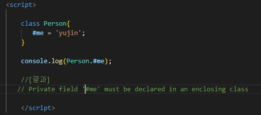
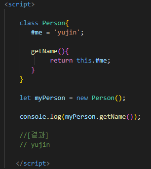
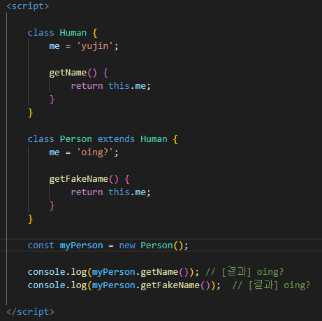
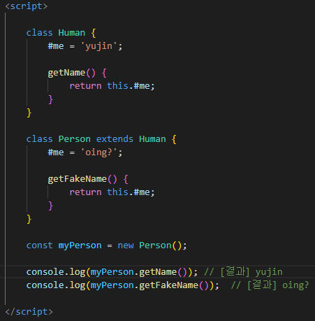
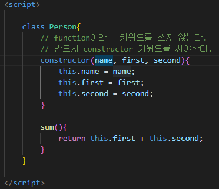
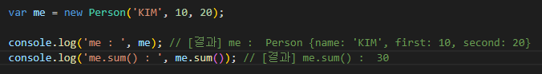
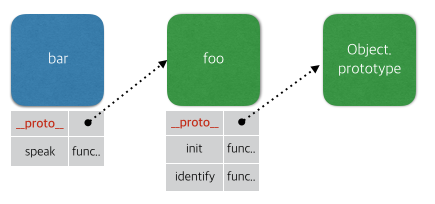

## 객체지향 프로그래밍은 무엇일까요?
* 객체지향 프로그래밍(Object-Oriented Programming, OOP)이란, 프로그래밍에서 필요한 데이터를 추상화시켜 **상태와 행위**를 가진 객체로 만들고, 객체들간의 상호작용을 통해 로직을 구성하는 프로그래밍 방법이다.
* 객체지향 프로그래밍은 `추상화`, `캡슐화`, `상속`, `다형성`의 특징을 가진다.
    * `추상화` : 객체에서 공통된 속성과 행위를 추출하는 것. 불필요한 정보는 숨기고 중요한 정보만을 표현함으로써 프로그램을 간단하게 만든다.
    * `캡슐화` : 데이터 구조와 데이터를 다루는 방법들을 결합시켜 묶는 것. 낮은 결합도를 유지할 수 있도록 설계한다.
    * `상속` : 클래스의 속성과 행위를 하위 클래스가 물려받는 것. 새로운 클래스가 기존의 클래스의 데이터와 연산을 이용할 수 있게 한다.
    * `다형성` : 하나의 변수와 함수가 상황에 따라 다른 의미로 해석될 수 있다. 상위 클래스의 행위를 하위 클래스에서 재정의하여 사용할 수 있기 때문에 다형성이라는 특징을 갖게 된다.
    
### #로 시작하는 프라이빗 필드는 왜 필요한 것일까요? 정보를 은폐(encapsulation)하면 어떤 장점이 있을까요?
* private 필드는 '#' 식별자로 선언된다. 해당 private 필드를 선언한 클래스 내부에서만 접근과 변경이 가능하며, 클래스 외부에서는 값을 읽을 수도 변경할 수도 없다.
* 객체의 private한 속성을 만들 수 없었던 자바스크립트에서는 대안으로 `_`를 속성명에 사용하는 대안을 사용해 왔었다. 그러나 이 방법은 실제로는 public으로 동작하기 때문에 외부에서 얼마든지 접근할 수 있다.
* 대신 `#` 프리픽스를 이용하여 속성을 만들면
 

 
클래스 외부에서 접근할 수 없는 속성이라는 에러 메시지가 출력되고  
 
외부에 getName()이라는 getter를 노출해 #me의 값에 접근할 수 있게 된다.

 

 

* private 속성은 클래스 별로 독립적인 공간을 갖게 한다. 쉽게 말하면 Human클래스 스코프의 #me과 Person클래스 스코프의 #me는 다르다는 것이다.  
 
**public**
 

 

**private**
 

 

이런식으로 정보 은닉을 하면 외부에 공개할 필요가 없는 정보들을 감추어 적절치 못한 접근으로부터 객체의 상태가 변경되는 것을 방지해 정보를 보호하고, 객체 간의 상호의존성을 낮출 수 있다.

### 다형성이란 무엇인가요? 다형성은 어떻게 코드 구조의 정리를 도와주나요?
* 다형성이란 하나의 객체가 여러가지 타입을 가질 수 있는 것을 의미한다.
* 다형성을 활용하면 기능을 확장하거나, 객체를 변경해야 할 때 타입 변경없이 객체 주입만으로 수정이 일어나게 할 수 있다. 또한 상속을 사용하면 중복되는 코드까지 제거할 수 있다.

* 종류
1. 오버로딩  
한 클래스 내에 이미 사용하는 이름의 메소드가 있더라도 특정 규칙을 지킨다면, 동일한 이름의 메소드를 정의하도록 허용한다.   
    
    [특정 규칙] 
    1. 메소드의 이름이 같아야 한다.  
    2. 매개 변수의 개수 또는 타입이 달라야 한다.  
    3. 매개 변수는 같고, 리턴 타입이 다를 때는 성립하지 않는다.  
    4. 오버로딩된 메소드들은 매개 변수로만 구분될 수 있다.  

==> 여러 종류의 타입을 받아들여 같은 기능을 하도록 만든다.

2. 오버라이딩  
상위 클래스의 메소드를 하위 클래스에서 재정의 하는 것. 상속을 통해 구현할 수 있다. 

3. 함수형 인터페이스(Functional Interface)  
람다식(익명함수)을 사용하기 위한 API로 자바에서 제공하는 인터페이스에 구현할 메소드가 하나 뿐인 인터페이스를 의미한다. 함수형 인터페이스는 enum과 함께 사용한다면 다형성의 장점을 경험할 수 있다.

### 상속이란 무엇인가요? 상속을 할 때의 장점과 단점은 무엇인가요?
* 상속은 상위 클래스에 중복 로직을 구현해두고 이를 물려받아 코드를 재사용하는 방법이다.
* [장점]
    * 재사용으로 인해 코드가 줄어든다.
    * 데이터와 메소드의 자유로운 사용 및 추가가 가능하다.
* [단점]
    * 캡슐화가 깨지고 결합도가 높아짐 : 부모 클래스를 기반으로 자식 클래스의 코드를 구현해야 하기 때문에 부모 클래스의 내부 구조를 잘 알고 있어야 한다. 부모 클래스의 구현은 자식 클래스에게 노출되어 캡슐화가 약해지고, 자식 클래스와 부모 클래스는 강하게 결합되어 부모 클래스를 변경할 때 자식 클래스도 함께 변경될 가능성이 높아진다.
    * 유연성 및 확장성이 떨어짐 : 부모 클래스 변경시 자식 클래스도 변경해주어야 할 가능성이 크기 때문에 변경에 대한 범위가 커지므로 유연성과 확장성이 떨어진다.
    * 클래스 폭발 문제의 발생 : 상속을 남용하게 되면 필요 이상으로 많은 수의 클래스를 추가해야하는 문제가 발생할 수 있다. 이는 자식 클래스가 부모 클래스의 구현과 강하게 결합되는 상속의 근복적인 한계 때문에 발생한다. 자식 클래스와 부모 클래스의 다양한 조합이 필요한 상황에서 유일한 해결 방법은 조합의 수 만큼 새로운 클래스를 추가하는 것뿐이기 때문이다. 
    * 다중 상속에 의한 문제 발생 : 다중 상속이 허용되지 않아 상속이 필요한 클래스가 다른 클래스를 이미 상속 중이라면 문제가 발생할 수 있다.

### OOP의 합성(Composition)이란 무엇인가요? 합성이 상속에 비해 가지는 장점은 무엇일까요?
* 코드 재사용 기법으로 기존 클래스를 상속을 통한 확장하는 대신, 필드로 클래스의 인스턴스를 참조하게 만드는 설계이다.
* 예를 들어 서로 관련이 없는 클래스의 관계에서, 한 클래스가 다른 클래스의 기능을 사용하여 구현해야 한다면 합성의 방식을 사용하는 것이다.
* A클래스가 B클래스의 기능이 필요하다고 해서 무조건 상속하지 않고, 따로 클래스 인스턴스 변수에 저장하여 가져다 쓰는 원리이다.

* [장점]
1. 상속을 하게 되면 컴파일 시점에 관계가 결정되어 결합도가 높아진다. 합성을 이용하면 런타임에 의존성이 결정되기 때문에 결합도를 낮출 수 있다.
2. 상속은 불필요한 기능을 상속하게 한다. 또한 자바에서는 클래스이 다중 상속을 허용하지 않는데, 이는 결국 클래스 폭발로 이어지게 한다. 합성을 사용하면 필요한 기능을 필요한 만큼 필드에 정의해 두어 사용하면 되기 때문에 단일 상속의 한계를 어느 정도 해소해 준다.
    
***

## 자바스크립트의 클래스는 어떻게 정의할까요?
* 클래스는 객체를 찍어내는 공장으로, constructor function을 대체한다.
 

 

이렇게 클래스를 만들고 `new`를 통해 호출하면 객체가 생성된다.

 

 

* 특징
1. 클래스는 함수로 호출될 수 없다.
2. 클래스 선언은 let과 const처럼 블록 스코프에 선언되며, 호이스팅(hoisting)이 일어나지 않는다.
3. 클래스의 메소드 안에서 super 키워드를 사용할 수 있다.
5. Getter 혹은 setter를 정의하고 싶을 때는 메소드 이름 앞에 get 또는 set을 붙여주면 된다.

### 프로토타입 기반의 객체지향 프로그래밍은 무엇일까요?
* 프로토타입 기반의 객체지향 프로그래밍은 객체지향 프로그래밍의 한 형태로 클래스가 없고, 객체를 원형(프로토타입)으로 하여 복제의 과정을 통해 객체의 동작 방식을 다시 하용할 수 있는 것이다.
* 자바스크립트에서는 복제가 아닌 프로토타입 링크를 통해 원형을 참조한다.

 

 

==> bar 객체는 foo 객체를 원형으로 생성되었기 때문에 프로토타입 링크 `__proto__`를 통해 foo를 참조하고 foo에서 정의한 init과 identify 함수를 모두 사용할 수 있다.

* 이렇게 객체들 사이에 형성된 일련의 링크(프로토타입 링크)를 프로토타입 체인이라고 한다.

### 자바스크립트의 클래스는 이전의 프로토타입 기반의 객체지향 구현과 어떤 관계를 가지고 있나요?
* 클래스 기반에서 클래스는 일종의 틀을 만들고 이 틀로 객체들을 만들어내며 이 관계를 상속이라고 한다. 프로토타입 기반에서는 프로토타입 객체라고 하는 원본 객체를 만들고 객체는 이와 연결(링크)되어서 만들어지고 참조되며, 이는 상속을 모방하는 동작에 가깝다.
* 자바스크립트는 객체 지향이지만 기존의 클래스 기반 프로그래밍 방식을 따르지 않고 프로토타입 기반 프로그래밍 방식으로 동작한다. ES6 이후로 클래스 문법이 출현하였는데, 단지 생성자 - 프로토타입 패턴을 숨기기 위함에 불과하고 여전히 프로토타입 기반 언어이다.
* 그러나 자바스크립트에서 클래스는 같은 코드를 보다 알기 쉬운 문법으로 작성할 수 있게 해준다.(문법적 설탕) 
